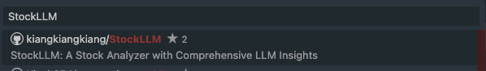
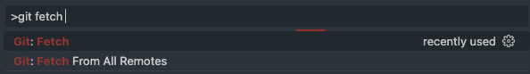
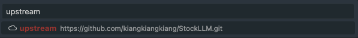
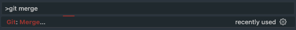
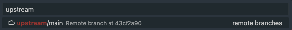

## Contributing

1. **Fork this repository**: Go to the GitHub repository you want to contribute to and click the Fork button at the top right of the page. This will create a copy of the repository under your GitHub account.
2. **Clone the Repository**: `git clone <your-forked-repo-url>`
3. **Add the source repo as remote**:

    - CLI

        ```bash
        git remote add upstream https://github.com/kiangkiangkiang/StockLLM
        ```
    
    - VSCode

        

        

4. **Fetch from remote and merge the difference before you get started**:

    - CLI

        ```bash
        git fetch upstream
        git checkout main
        git merge upstream/main
        ```
    
    - VSCode

        

        

        

        


## Environment Setup

### Dev Environment

- ubuntu 20.04
- python 3.9

### Dev Setup

```
pip install -r requirements.txt -r requirements-dev.txt
```

```
pre-commit install
```

### 資料存取區 S3 資料夾

#### 透過專案初始化獲取分析資料

1. 創建 `.env` 文件

在你的項目根目錄下創建一個 `.env` 文件，並添加以下內容：

```
AWS_ACCESS_KEY_ID=your_access_key_id
AWS_SECRET_ACCESS_KEY=your_secret_access_key
AWS_DEFAULT_REGION=your_default_region
AWS_OUTPUT_FORMAT=json
```

2. 執行 `make init` 或 `sh sh/init.sh`，會自動安裝 `aws cli` 以及使用 credential 下載數據

```bash
$make init
sh sh/init.sh
Data folder already exists.
Installing AWS CLI on macOS...
AWS CLI already installed.
Configuring AWS CLI...
download: s3://ai-s3-disk/datasets/StocksData/stock_dates.csv to data/stock_dates.csv
download: s3://ai-s3-disk/datasets/StocksData/stock_daily.csv to data/stock_daily.csv
download: s3://ai-s3-disk/datasets/StocksData/stock_daily_v2.csv to data/stock_daily_v2.csv
```
